# Drawing on the Web Final Project

## Drop-Out - A Visual Essay

The project I have planned revolves thematically and aesthetically around a webcomic called Drop-Out. While not entirely finished, the comic is nearing completion, and I want to use the three web drawings in this project to highlight three of the most prominent visual motifs thus far - meat, fuel, and injuries. This will be done primarily by displaying various panels where at least one of these are apparent to the reader, as a sort of montage, lightly animated with JavaScript to add some dynamism. These pages will not be interactive.
 
## Brief Theme Explanation

* 1) The character with brown fur is Sugar Kysley, and she’s an obligate carnivore. Her reliance on meat, which has an inherent violence in its creation, is directly compared to the negative and ‘draining’ effect she has on most others, a combination of both emotional and literal vampirism. 

* 2) This is closely connected to the motif of blood and injury. Here, the blood is a physical manifestation of guilt, particularly over enabling destructive behaviors in those around you - literally having blood on your hands. This is one of the most central themes of the comic; not only guilt about having hurt others, but guilt over not being able to stop them from hurting themselves. 

* 3) This is where fuel comes in, coming in the form of both gasoline and lighter fluid. I will step around this in the presentation, but this plays directly into the premise of the comic, which is that Sugar and her partner Lola (the purple one) are taking a ‘road trip’ to the Grand Canyon to commit suicide together.

Below, I’ve included some of these panels, as examples of the sorts of images. This project isn’t intended to be immediately understandable to non-readers, though I will give short explanations during the presentation. 

The navigational page will have side-by-side ‘previews’ of each page, with interactivity done through CSS animation. The art will come from the comic itself, and I’ll include credit the creator with a link back to the comic.

## Sample panels - Meat

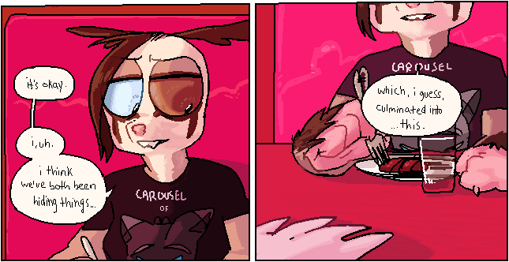

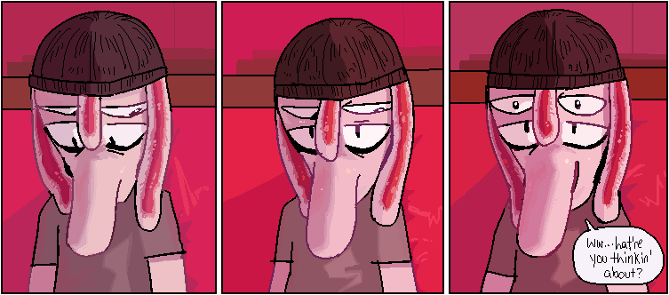

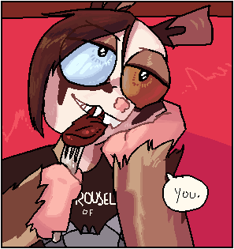

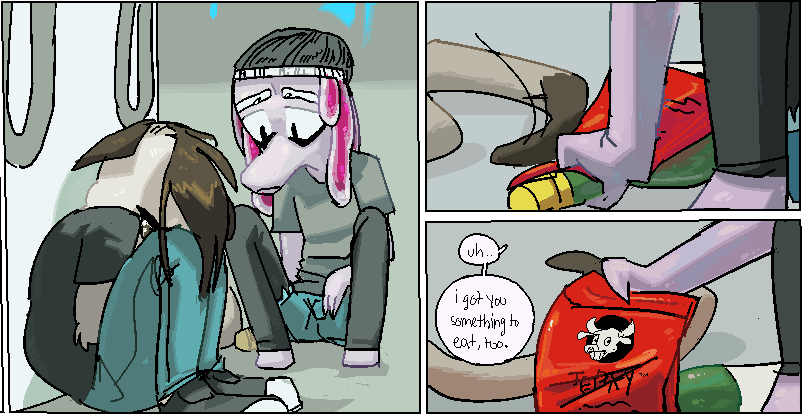

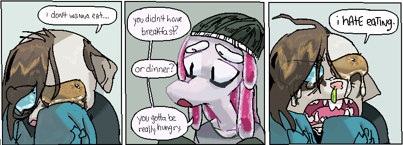

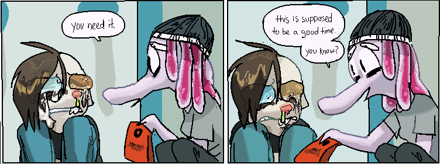

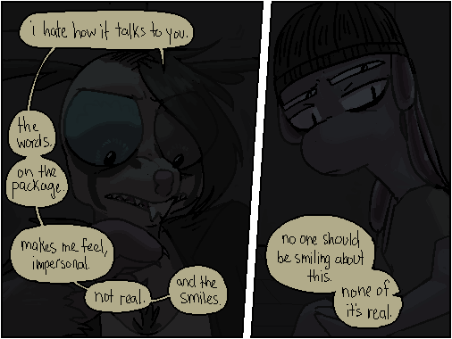

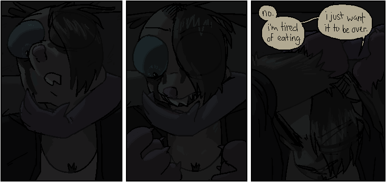

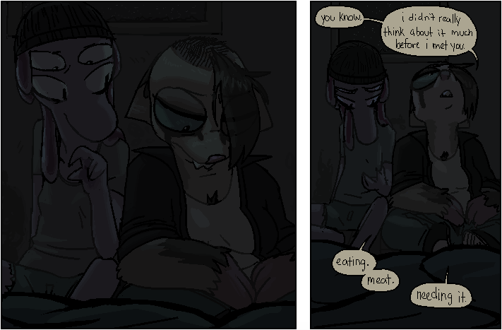

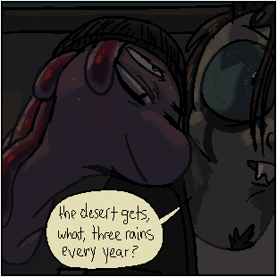

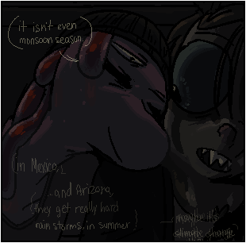

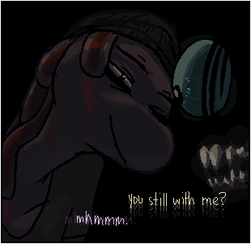

## Sample panels - Fuel

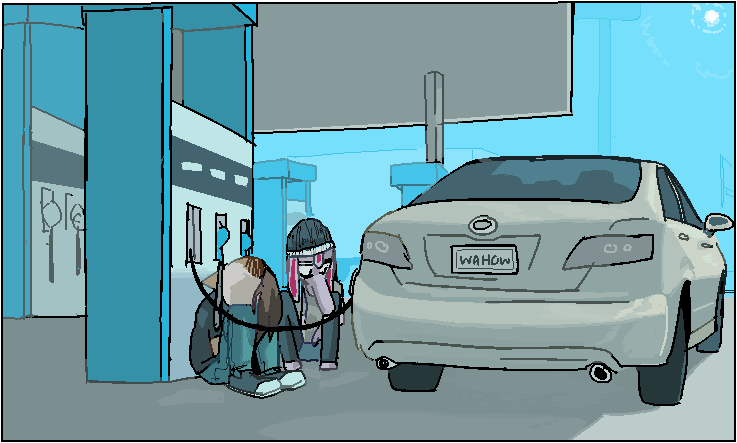

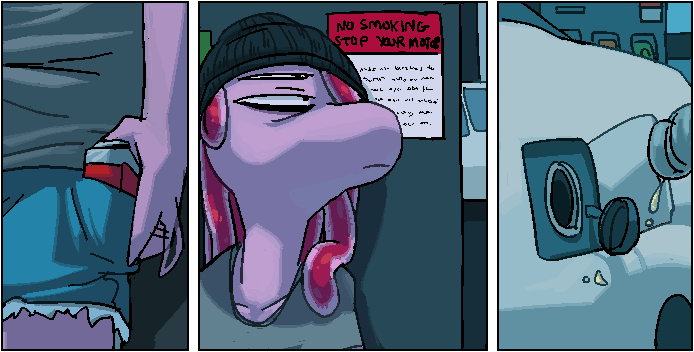

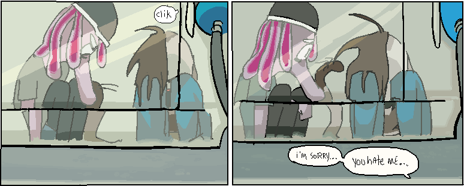

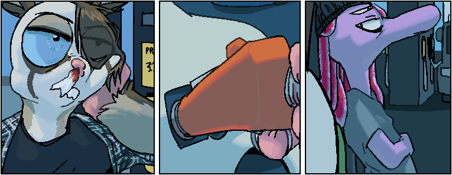

## Sample panels - Blood

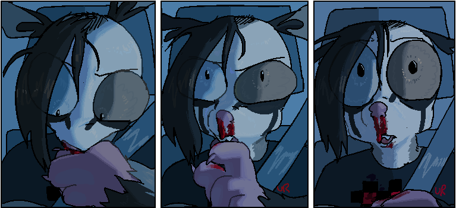

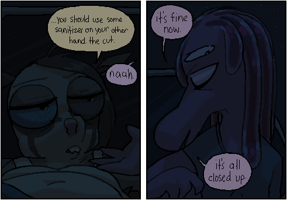

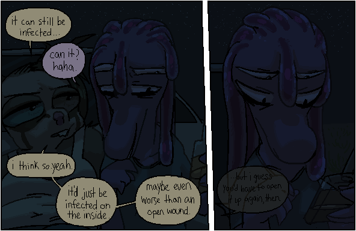

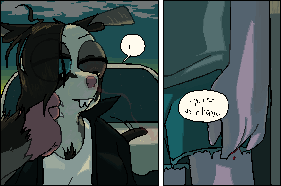

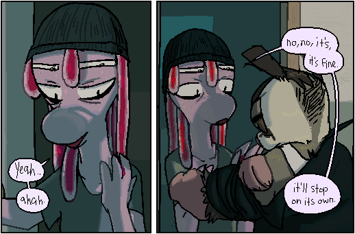

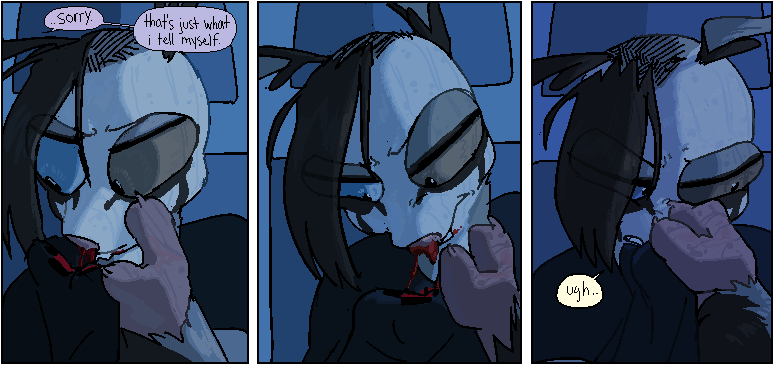